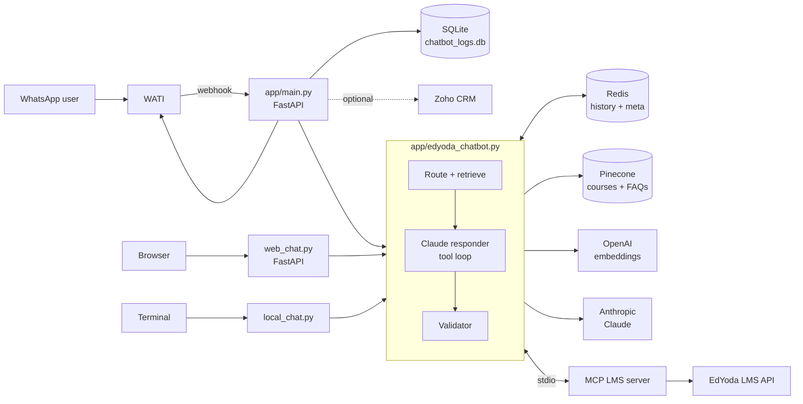

# Architecture

## Overview

The chat core is a plain synchronous Python function, `chat(session_id, user_input)`. The FastAPI apps
are thin wrappers that run it in a worker thread (`anyio.to_thread.run_sync`) so the event loop is never
blocked by LLM/Pinecone calls.

## Request pipeline (`chat()` in `app/edyoda_chatbot.py`)

For one user message:

1. **Load history** – last 20 messages for the session from Redis.
2. **Build the retrieval query**
   - Default ("legacy"): user message + the last 4 assistant replies.
   - With `RAG_CONDENSE_QUERY=true`: a cheap model rewrites follow-ups ("when does it start?") into a
     standalone query, so the bot's own prose never pollutes the embedding.
3. **Route and retrieve** (`route_and_retrieve`)
   - Embed the query with OpenAI `text-embedding-3-large`.
   - Query both Pinecone indexes (top 3 each).
   - Mode is decided on the **raw** user message scores: `faqs` only if the FAQ score ≥ 0.5 **and** beats the
     course score by ≥ 0.3; otherwise `courses`. Courses are the deliberate default because routing a
     course question to FAQ leads to a "no details" answer.
   - In course mode, vector hits are merged with a local **name/description keyword search** over the
     in-memory course cache (fuzzy matching, name-coverage bonus) so courses with weak embeddings still surface.
4. **Assemble the user turn** – geo hint from the phone prefix (`91`→India, `44`→UK, `1`→US), optional
   `<customer>` name context, then `<course_context>` or `<faq_context>`, then the question.
5. **Claude responder** – `system_prompt.txt` (re-read every call), adaptive thinking, up to 5 retries with
   exponential backoff. Available tools: the MCP tools plus `save_customer_name` (only while the name is unknown).
6. **Tool loop** – up to 3 rounds of `tool_use` → execute → feed result back.
7. **Validator** (`validate_and_correct`) – deterministic checks first:
   - Every `edyoda.com` URL must match a known course slug.
   - "Course doesn't exist" phrasing is checked against the name-search cache.
   - Phone numbers must match the authorized support numbers or FAQ data, and carry a country code.

   Only if an issue is found is the validator model called to rewrite the draft. Otherwise the reply passes through untouched.
8. **Deterministic guarantee** – if the batch tool said "no upcoming batch", the support number is appended
   if the model omitted it.
9. **Persist** – append the exchange to Redis (trim to 20, refresh 30-day TTL).
10. **Deflection flag** – `is_deflected` is true when the best raw retrieval score is below 0.35 (out of domain)
    or the reply contains a "we don't have / can't find" phrase.

## Components

### Core (`app/edyoda_chatbot.py`)
Routing, retrieval, the Claude call, tool loop and validator. Also holds the in-memory **course cache**:
all visible courses are fetched from Pinecone and kept in memory (TTL 6 h by default) for keyword search and URL validation.
Course **visibility** is read live from the LMS (`/api/v1/course-visibility`) at each cache load; if the LMS is
unreachable it falls back to the `visibility_status` metadata stored in Pinecone.

Models are chosen by env var and validated against allow-lists; an unrecognised ID logs an error and falls
back to the default instead of failing every request.

### Session store (`app/chat_history.py`)
Redis only – nothing is held in process memory.

| Key | Type | Contents |
|-----|------|----------|
| `chat:session:<id>` | list | JSON `{role, content, ts}`, trimmed to 20, TTL 30 days |
| `chat:meta:<id>` | hash | `last_user_ts`, `last_assistant_ts`, `channel_phone_number`, `reassigned_to_bot`, `name_status`, `customer_name`, … |
| `chat:dedupe:<msgid>` | string | 10-min idempotency guard (non-RAG path) |
| `chat:buf:<id>`, `chat:buf_last:<id>`, `chat:buf_lock:<id>` | list/string | Debounce buffer, last-seen timestamp, coalescer lock |

`redis-memory.conf` caps Redis at 500 MB with `volatile-lru`, so only keys with a TTL (sessions) can be evicted.

### WhatsApp server (`app/main.py`)
- `POST /webhook/wati` handles:
  - `chatAssigned` events – fetches the last user message from WATI history and sends a contextual greeting/reply.
  - Text messages – **debounced**: chunks are buffered in Redis and one reply is sent after 8–10 s of silence,
    so multi-part messages get a single answer. A Redis lock ensures only one coalescer runs per user.
  - Image messages – downloaded and answered with Claude vision.
  - Owner (agent) messages and non-message events are acknowledged and ignored.
- Replies may include FAQ step-by-step screenshots (up to 3 images with captions).
- **Idle reassignment** – a background loop (every 60 s) reassigns chats idle ≥ 90 minutes back to the WATI "Bot" operator.
- **Deflection alerts** – deflected conversations trigger a WATI template message to `DEFLECT_ALERT_NUMBERS`.
- Conversations are logged to SQLite (`chatbot_logs.db`) and viewable at `/admin/chat-logs`.
- Admin routes edit prompts, refresh the course cache and trigger CRM jobs.
- A catch-all route returns `200 Hello World` for any unknown path so WATI callbacks never see errors.

### Web chat (`web_chat.py`, `static/chat.html`)
A separate, minimal FastAPI app. It calls `ask()` directly and reads history from the same Redis store.
It loads `.env.local` (not `.env`) by default so a developer never writes into production Redis.
It does **not** write to the SQLite log, send WATI messages, or run background jobs.

### MCP tool server (`mcp_servers/edyoda_lms_server.py`, `app/mcp_client.py`)
The LMS tools run in a separate child process over **stdio**, using the Model Context Protocol.
`mcp_client.py` spawns it once, keeps a persistent session on a dedicated event-loop thread, and exposes a
synchronous `get_anthropic_tools()` / `call_tool()` API. If the server cannot start, the bot simply runs
without tools.

Current tool: `get_batch_start_date(course_query)` – takes a course URL slug and returns the next cohort start date.
It is designed for later "Tier-2" user-private tools: `call_tool(..., context=...)` injects the verified caller
identity out-of-band for tools listed in `_IDENTITY_TOOLS`, and it never appears in the model-facing schema.

### CRM integration (`app/crm_notes/`, `app/name_capture.py`) – all optional, all off by default
| Feature | Flag | What it does |
|---------|------|--------------|
| Name capture | `NAME_CAPTURE_ENABLED` | Looks up the caller in the CRM once per conversation; asks for the name at most once and writes it back. |
| CRM notes | `CRM_NOTES_ENABLED` | Hourly job: summarises settled conversations (via OpenRouter) and adds a call-prep note to the matching lead, creating one if needed. |
| Lead dedup | `CRM_DEDUP_ENABLED` | Twice daily (IST): merges a person's older duplicate leads into the newest one and writes a rollback file. |

The CRM layer is provider-based (`crm/base.py`); Zoho is the only implementation, talking to Zoho's MCP endpoint over JSON-RPC.

## Data stores

| Store | Used for | Persistence |
|-------|----------|-------------|
| Redis | Session history, metadata, debounce state | 30-day TTL, 500 MB cap |
| Pinecone | Course and FAQ vectors + metadata | External, managed |
| SQLite `chatbot_logs.db` | Conversation log for the admin viewer | Local file, created on first start of `app/main.py` |

## Design decisions

- **Sync core, async shell.** The core is easy to test from a terminal; FastAPI hands it to worker threads.
- **Validate, don't trust.** Facts a customer could act on (URLs, phone numbers, availability) are checked in code, not just prompted.
- **Fail open.** MCP, CRM, LMS visibility and name capture all degrade gracefully instead of blocking a reply.
- **Config over code.** Models, indexes, cache TTL and feature flags come from environment variables.
- **Prompts are data.** Both prompts are text files read on every call; no restart or deploy is needed to change them.
